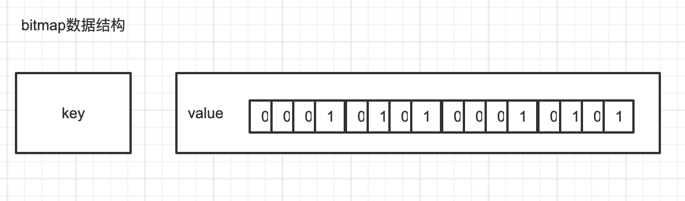

#Redis位图（BitMap）

1. 用一个比特位来映射某个元素的状态。
2. 大量的节省内存空间。
3. **并非一个新的数据类型，本质上还是一个String类型**

## 数据结构

类似于以比特位为单位的数组，数组的每个单元只能存储0和1，数组的下标在 Bitmaps 中叫做偏移量。



## bitmap命令

```js
# 设置值，其中value只能是 0 和 1
setbit key offset value

# 获取值
getbit key offset

# 获取指定范围内值为 1 的个数
# start 和 end 以字节为单位
bitcount key start end

# 返回指定key中第一次出现指定value(0/1)的位置
bitpos [key] [value]

# BitMap间的运算
# operations 位移操作符，枚举值
  AND 与运算 &
  OR 或运算 |
  XOR 异或 ^
  NOT 取反 ~
# result 计算的结果，会存储在该key中
# key1 … keyn 参与运算的key，可以有多个，空格分割，not运算只能一个key
# 当 BITOP 处理不同长度的字符串时，较短的那个字符串所缺少的部分会被看作 0。返回值是保存到 destkey 的字符串的长度（以字节byte为单位），和输入 key 中最长的字符串长度相等。
bitop [operations] [result] [key1] [keyn…]
```

## 占用空间

```js
# 首先将偏移量是0的位置设为1
127.0.0.1:6379> setbit testkey 0 1
(integer) 0
# 通过STRLEN命令，我们可以看到字符串的长度是1
127.0.0.1:6379> STRLEN testkey
(integer) 1
# 将偏移量是1的位置设置为1
127.0.0.1:6379> setbit testkey 1 1
(integer) 0
# 此时字符串的长度还是为1，因为一个字符串有8个比特位，不需要再开辟新的内存空间
127.0.0.1:6379> STRLEN testkey
(integer) 1
# 将偏移量是8的位置设置成1
127.0.0.1:6379> setbit testkey 8 1
(integer) 0
# 此时字符串的长度变为了2，因为一个字节存不下9个比特位，需要再开辟一个字节的空间
127.0.0.1:6379> STRLEN testkey
(integer) 2
```

通过上面可以看出，一个字符串是 8 个字节，最大偏移量为 offset，那么：

```
占用字节数 = (offset / 8) + 1
```

Redis 中字符串的最大长度是 512M，所以 BitMap 的 offset 值也是有上限的，其最大值是：

```
8 * 1024 * 1024 * 512  =  2^32 - 1
# 由于 C语言中字符串的末尾都要存储一位分隔符
```

